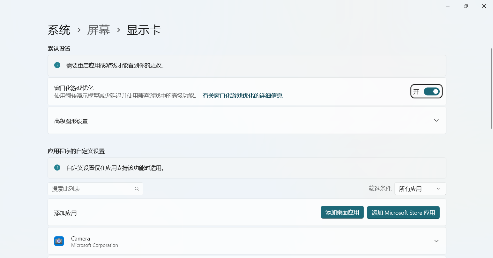
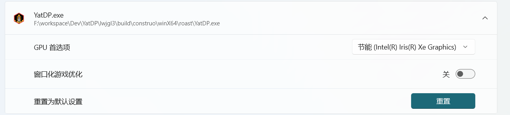

# YatDP

这是一个使用 [libGDX](https://libgdx.com/) 构建的项目，通过 [gdx-liftoff](https://github.com/libgdx/gdx-liftoff) 生成。

## Run and Package
关于如何调试与运行程序，请查看 [Running it](https://libgdx.com/wiki/start/import-and-running) 
与 [Packaging](https://libgdx.com/wiki/deployment/bundling-a-jre)

如果运行后发现程序背景为黑屏 (而不是透明的) ，说明你用的是英伟达的显卡。这是英伟达显卡的 BUG 。
请参考以下解决方案：
1. 先参考 [Packaging](https://libgdx.com/wiki/deployment/bundling-a-jre) 把程序打包成一个`.exe` 文件。
2. 进入WINDOWS图形设置页面，我这里以 WIN11 为例：在设置页面中进入`系统`子页面，再进入`屏幕`子页面，之后在*相关设置*中进入`显示卡`子页面
    
3. 在`应用程序的自定义设置`中选择*添加桌面应用*，然后添加我们刚刚打包生成的`.exe` 文件。
4. 之后在该程序的配置中，*GPU首选项*一栏选择“节能xxxx”，关闭*窗口化游戏优化*。
   
5. 之后再重新运行`.exe`程序，应该就能正常显示了。

## Platforms

- `core`：所有平台共享的核心业务逻辑模块
- `lwjgl3`：基于 LWJGL3 的桌面平台主模块

## Gradle

项目使用 [Gradle](https://gradle.org/) 管理依赖项。  
已包含 Gradle wrapper，可通过 [gradlew.bat](file://F:\workspace\Dev\YatDP\gradlew.bat) 或 [./gradlew](file://F:\workspace\Dev\YatDP\gradlew) 命令执行 Gradle 任务。

常用 Gradle 任务与参数：

### 标准参数
- `--continue`：即使发生错误也继续执行任务
- `--daemon`：使用 Gradle 守护进程执行任务
- `--offline`：使用本地缓存依赖项
- `--refresh-dependencies`：强制验证所有依赖项（用于快照版本）

### 核心任务
- `build`：构建所有项目的源码和归档文件
- `cleanEclipse`：清除 Eclipse 项目配置
- `cleanIdea`：清除 IntelliJ 项目配置
- `clean`：删除 `build` 文件夹（包含编译类和构建文件）
- `eclipse`：生成 Eclipse 项目配置
- `idea`：生成 IntelliJ 项目配置
- `lwjgl3:jar`：构建可运行 JAR 包（输出路径：`lwjgl3/build/libs`）
- `lwjgl3:run`：启动应用程序
- `test`：运行单元测试（如有）

> 说明：大多数非特定项目的任务都可使用 `name:` 前缀指定项目  
> 示例：`core:clean` 将仅删除 core 模块的 `build` 文件夹
